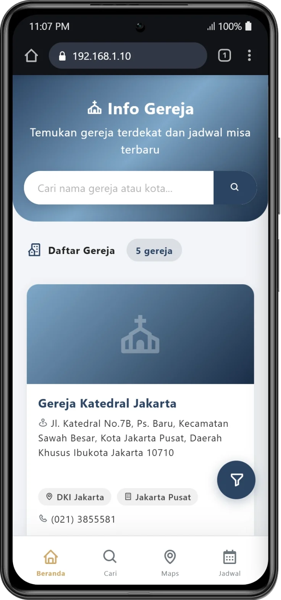
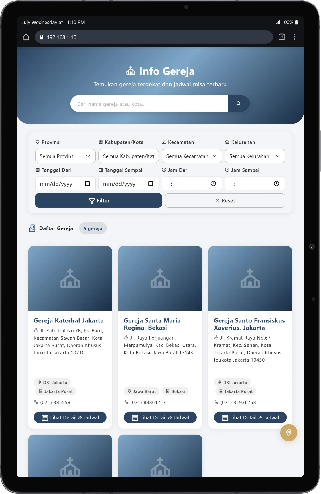

<p align="center">
  
</p>
<h1 align="center">Info Gereja Katolik Indonesia</h1>
<p align="center">
  <strong>Direktori & Jadwal Misa Gereja Katolik Seluruh Indonesia</strong>
  <br>
  <sub>Built with PHP MVC — Compatible with PHP 5.2, 7, 8+</sub>
</p>

<p align="center">
  <a href="#-tentang-proyek">Tentang</a> •
  <a href="#-fitur-utama">Fitur</a> •
  <a href="#-screenshot">Screenshot</a> •
  <a href="#-quick-start">Quick Start</a> •
  <a href="#-routing">Routing</a> •
  <a href="#-teknologi">Teknologi</a>
</p>

---

## 📋 Tentang Proyek

**Info Gereja Katolik Indonesia** adalah aplikasi web direktori gereja katolik yang menyediakan informasi lengkap tentang gereja-gereja katolik di Indonesia, termasuk jadwal misa, lokasi, kontak, dan sosial media. Dilengkapi panel admin untuk mengelola data gereja, jadwal misa, dan saran dari pengunjung.

Dibangun dengan arsitektur **MVC PHP murni** (tanpa framework berat) yang dirancang agar kompatibel dengan berbagai versi PHP dari 5.2 hingga 8+.

---

## ✨ Fitur Utama

### 🌐 Halaman Publik
| Fitur | Deskripsi |
|-------|-----------|
| 🏠 **Beranda** | Daftar gereja dengan filter provinsi & kabupaten |
| 🔍 **Pencarian** | Cari gereja berdasarkan nama, lokasi, atau kata kunci |
| ⛪ **Detail Gereja** | Alamat, foto, jadwal misa, peta interaktif, sosial media |
| 📅 **Jadwal Misa** | Lihat jadwal misa dari semua gereja |
| 🗺️ **Peta Interaktif** | Leaflet.js dengan 7 layer peta, marker & bottom sheet detail |
| 📝 **Kotak Saran** | Pengunjung bisa mengusulkan perubahan jadwal |

### 🔧 Panel Admin
| Fitur | Deskripsi |
|-------|-----------|
| 📊 **Dashboard** | Statistik total gereja, jadwal, saran pending |
| ⛪ **Kelola Gereja** | CRUD gereja dengan foto, sosial media, lokasi (cascading select provinsi → kelurahan) |
| 📅 **Kelola Jadwal** | CRUD jadwal misa per gereja dengan filter & pencarian |
| 📨 **Kotak Saran** | Approve / tolak saran perubahan jadwal dari pengunjung |
| 🌐 **Sosial Media** | Kelola link Instagram, YouTube, Twitter, Facebook, Website, dll. (bisa lebih dari 1) |

### 🛡️ Keamanan
| Lapisan | Fitur |
|---------|-------|
| 🛡️ CSRF Protection | Token unik setiap form submission |
| 🔐 XSS Protection | Output escaping & sanitasi input |
| ✅ Input Validation | Validasi email, URL, numeric, string |
| 🗃️ SQL Injection | Prepared statements & parameter binding |
| 🔑 Password Security | Bcrypt / Argon2 hashing |
| 🍪 Session Security | HttpOnly, SameSite, server-side sessions |
| 🚦 Rate Limiting | Mencegah brute force attacks |
| 🔒 Security Headers | X-Frame-Options, X-Content-Type-Options, CSP |

---

## 📸 Screenshot

### 📱 Mobile — Xiaomi Mi 11i

| | | |
|:-:|:-:|:-:|
| Beranda | Beranda (Filter Aktif) | Cari Gereja |
|  |  |  |
| **Detail Gereja** | **Jadwal Misa** | **Filter Drawer** |
|  |  |  |
| **Peta Interaktif** | **Bottom Sheet Detail** | **Admin Panel** |
|  |  |  |

### 💻 Tablet — Galaxy Tab S7

| | | |
|:-:|:-:|:-:|
| Beranda | Cari Gereja | Detail Gereja |
|  |  |  |
| **Jadwal Misa** | **Peta Interaktif** | **Admin Panel** |
|  |  |  |

---

## 🚀 Quick Start

### 1. Clone & Setup

```bash
git clone https://github.com/Yudhass/Gereja-Katolik-Indonesia.git
cd Gereja-Katolik-Indonesia
copy .env.example .env
```

### 2. Konfigurasi Database

Edit `.env` dan sesuaikan dengan environment Anda:

```env
DB_HOST=localhost
DB_NAME=db_gereja
DB_USER=root
DB_PASS=
DB_PORT=3306

BASE_URL=http://localhost/Gereja-Katolik-Indonesia/
```

### 3. Import Database

Buat database lalu jalankan migrasi:

```sql
CREATE DATABASE db_gereja CHARACTER SET utf8;
```

Jalankan migrasi via seeder (akan membuat tabel + mengisi data wilayah Indonesia):

```bash
# Atau import manual dari file SQL jika tersedia
```

### 4. Jalankan Aplikasi

**Via PHP built-in server:**
```bash
php -S localhost:8000 -t public
```

**Via XAMPP / Apache:**
Letakkan folder di `htdocs/` dan akses `http://localhost/Gereja-Katolik-Indonesia/`

### 5. Login Admin

| Role | Username | Password |
|------|----------|----------|
| Admin | `admin` | `admin123` |

Akses panel admin: `http://localhost/Gereja-Katolik-Indonesia/admin/dashboard`

> ⚠️ Segera ubah password default setelah login pertama!

---

## 🗺️ Routing

**File:** `app/routes/routes.php`

### Halaman Publik (Guest)
| Method | URL | Controller |
|--------|-----|------------|
| GET | `/` | `HomeController@index` |
| GET | `/gereja/{slug}` | `GerejaController@detail` |
| GET | `/cari` | `CariController@index` |
| GET | `/jadwal` | `JadwalController@index` |
| GET | `/maps` | `MapsController@index` |
| GET | `/saran/{slug}` | `SaranController@form` |
| POST | `/saran/kirim` | `SaranController@kirim` |

### Autentikasi
| Method | URL | Controller |
|--------|-----|------------|
| GET/POST | `/login` | `AuthController@login` |
| GET/POST | `/register` | `AuthController@register` |
| GET | `/logout` | `AuthController@logout` |

### Panel Admin (memerlukan login)
| Method | URL | Controller |
|--------|-----|------------|
| GET | `/admin/dashboard` | `AdminController@index` |
| GET | `/admin/gereja` | `AdminGerejaController@index` |
| GET/POST | `/admin/gereja/{id}` | `AdminGerejaController@get` / `update` / `delete` |
| GET | `/admin/gereja/getRegencies/{id}` | AJAX wilayah |
| GET | `/admin/jadwal` | `AdminJadwalController@index` |
| POST | `/admin/jadwal/add` / `update/{id}` / `delete/{id}` | CRUD jadwal |
| GET | `/admin/saran` | `AdminSaranController@index` |
| POST | `/admin/saran/approve/{id}` | Setujui saran |
| POST | `/admin/saran/reject/{id}` | Tolak saran |

---

## 📦 Database

### Tabel Utama
| Tabel | Keterangan |
|-------|------------|
| `admins` | Akun admin |
| `gereja` | Data gereja (nama, alamat, lokasi, kontak, slug) |
| `gereja_foto` | Foto gereja (multiple) |
| `gereja_social_media` | Sosial media / website gereja (multiple) |
| `jadwal_misa` | Jadwal misa per gereja |
| `saran_jadwal` | Saran perubahan jadwal dari pengunjung |
| `user_sessions` | Session server-side |

### Data Wilayah Indonesia
| Tabel | Jumlah Data |
|-------|-------------|
| `provinces` | 38 provinsi |
| `regencies` | 514 kabupaten/kota |
| `districts` | 7.277 kecamatan |
| `villages` | 83.763 kelurahan/desa |

---

## 💻 Fitur CRUD Model

Model menggunakan Active Record-style ORM dengan method lengkap:

```php
$gereja = new ModelGereja();

// Insert
$gereja->insert(array('nama_gereja' => '...', 'alamat' => '...'));

// Select
$all = $gereja->all();
$item = $gereja->find(1);
$items = $gereja->selectWhere('provinsi', 'Jawa Timur');

// Query Builder
$items = $gereja->where('provinsi', 'Jawa Timur')
                ->orderBy('nama_gereja', 'ASC')
                ->limit(10)
                ->get();

// Update
$gereja->update($data, $id);

// Delete
$gereja->delete($id);

// Raw Query
$items = $gereja->rawQuery("SELECT * FROM gereja WHERE ...", $params);
```

---

## 🛠️ Teknologi

| Stack | Teknologi |
|-------|-----------|
| **Backend** | PHP 5.2 / 7 / 8+ |
| **Database** | MySQL / MariaDB / PostgreSQL |
| **Frontend** | HTML5, CSS3, JavaScript, Bootstrap 5 |
| **Icons** | BoxIcons, LineIcons |
| **Maps** | Leaflet.js + OpenStreetMap (7 tile layers) |
| **Libraries** | jQuery, DataTables, Select2, SweetAlert2, MetisMenu |
| **PDF** | FPDF |
| **Architecture** | MVC Pattern (Custom Framework) |
| **Security** | CSRF, XSS, SQL Injection, Rate Limiting, RBAC |

---

## 📚 Dokumentasi

Dokumentasi lebih lengkap tersedia di folder `_DEV/`:
- **PRD** — Product Requirements Document
- **Plan** — Development plan & roadmap
- **Catatan** — Development notes

---

## 🤝 Kontribusi

Kontribusi sangat diterima! Silakan:
1. Fork repository
2. Buat branch fitur (`git checkout -b fitur-baru`)
3. Commit perubahan (`git commit -m 'Tambah fitur baru'`)
4. Push ke branch (`git push origin fitur-baru`)
5. Buat Pull Request

---

## 📄 License

MIT License — Silakan gunakan untuk pembelajaran atau kebutuhan pribadi.

---

## 👨‍💻 Credits

- **Base Template:** MVC-PHP-5-TEMPLATE
- **Inspirasi:** Laravel, CodeIgniter
- **Data Wilayah:** API Wilayah Indonesia

---

<p align="center">
  <strong>Info Gereja Katolik Indonesia</strong> — <em>Menghubungkan Umat dengan Gereja</em>
  <br>
  ⛪✨
</p>
